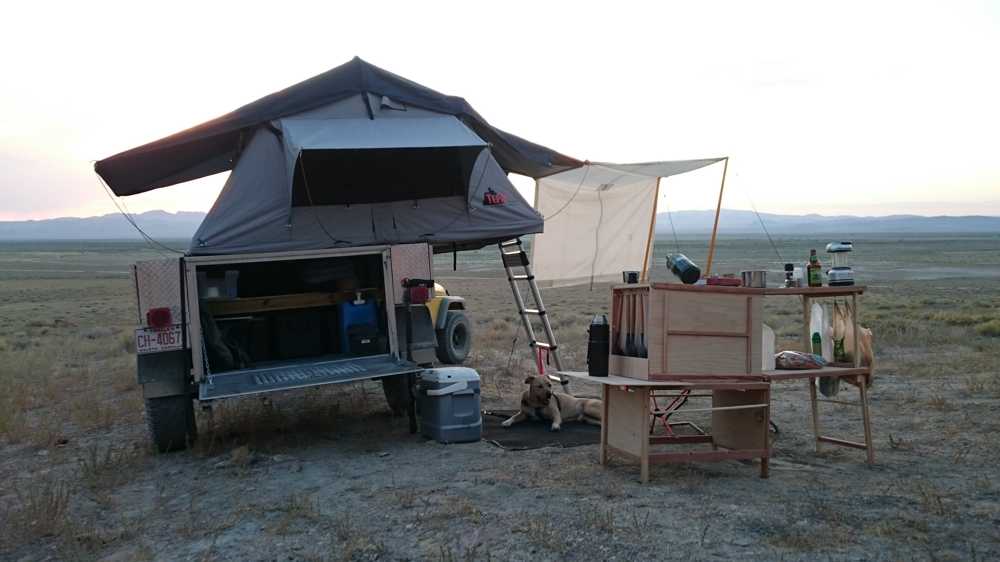
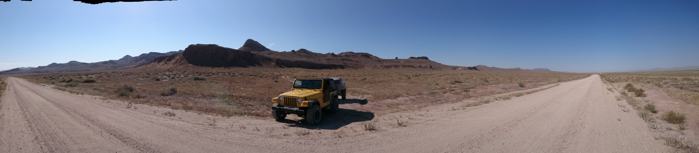

A custom offroad trailer built from scratch for overland travel.

===

# Project Requirements

## Objective
Build an offroad adventure trailer to pull behind my Jeep Wrangler TJ. It should comfortably accommodate 2 people and a dog for a week, along with gear for outdoor activities. The design should be modular to be suitable for many types of trips and activities. Effort should be made to integrate systems such as shelter, kitchen, and electrical as much as possible.

## Core Components
- Trailer chassis
- Trailer wiring
- Main compartment
- Side compartments
- Front compartment
- Rooftop tent
- Propane
- Fuel tanks

## User Flow

### Transport
- Tow hitch is a standard 2" receiver tube. Fitting a MaxCoupler allows full articulation, and it mounts into a standard 2" receiver on the vehicle. 
- Trailer wiring uses a standard 7-way RV plug. Standard 4-way lights are wired. Extra connectors available for 12V and ground from vehicle.

### Tent
- Tepui Kukenam Sky

### Security
- Main compartment door secured by 2-point folding t-handle, padlocks on top corners
- Side and front compartments lock w/key
- Fuel and propane tanks secured w/cable
- Chassis can be secured by heavy duty chain

## Measures of Success
- Accomodate two people and a dog for at least a week off-grid
- Meet legal registration requirements to pull on the highway
- Remain within load limits of a Jeep Wrangler TJ when fully loaded
- Maintain better ground clearance than the Jeep

## Future Features
The adventure trailer has been a fun project. It has traveled more than 10,000 miles over highways, and a few hundred miles offroad. Unfortunately the final result is overbuilt, and it's too heavy for the Jeep when fully loaded. Luckily I ended up learning an incredible amount from both building it and using it. Eventually I'll build another one that's lightweight and has its gear more integrated.

For a slightly larger tow vehicle it could fulfill many purposes as-is or with modification. Feel free to contact me if you're interested in purchasing it.

