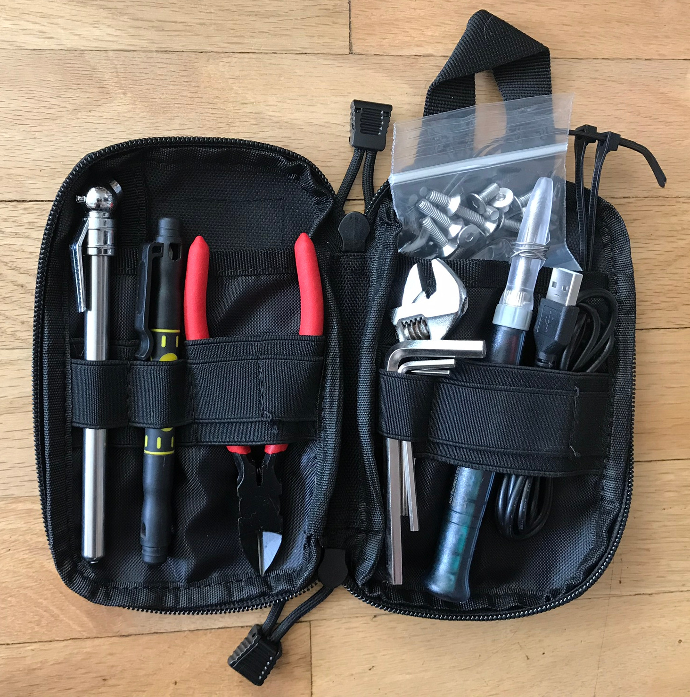

My [Onewheel](https://onewheel.com) kit, including charge-and-ride, tools, and safety gear. 

===

([wiki](http://onewheel.wiki))
# Product Requirements

## Objective
Compact toolkit to handle the majority of Onewheel maintenance and repairs. Small enough to easily fit in a backpack or cargo pocket.

## Core Components

### Charge & Ride (CnR)

- 36V LiPo battery pack w/BMS (x2)
- Dual battery case
- Solar MPPT charge controller
- 14ga fused cables (battery to charger)
- 16ga switched cable (charger to XLR)
- XLR plug w/flex-cable to barrel socket
- Backpack
- AC charger (not carried)

### Tool pouch

- Hex keys: 1/4, 1/8, 3/32
- Stanley 4-in-1 pen screwdriver
- Adjustable crescent wrench, 4"
- Diagonal cutters
- Tire pressure guage 5-50 psi
- Zip-ties, 2
- Stainless M5 screws, 2 ea: 8, 10, 12, 16, 18, 20 (mm)
- Pouch

### Backpack contents

- Air pump
- Tire pressure guage 5-50 psi
- Lock, ultralight
- USB power bank w/cables
- Tool pouch
- GoPro wrench
- Microfiber glasses bag
- Wool hat, ultralight
- Dust mask
- Water bottle w/insulator

### Safety gear

- Pro-tec skateboard helmet
- G-Form compression pads: knee, elbow, shorts
- Mechanix leather gloves
- VertX Phantom Ops Airflow pants
- Vans Sk8-Hi MTE
- Merino wool shirt, ultralight

It seems like Vertx stopped making the Airflow pants, which is a shame if true. Originally I received the grey pair, and the mesh was a lot more heavy duty than I expected, so I didn't end up wearing them much until I got the Onewheel. The mesh panels run down the back of the lower leg and through the cargo pockets, allowing plenty of airflow while moving but warm enough to wear down to freezing (especially with pads under).

For our sport they provide a great balance between airflow, protection, and durability. After my first major wreck in the original pair (23 mph on asphalt, see photo) I ordered a second pair in tan. Both pairs have seen a few major wrecks and still have plenty of life remaining.

## User Flow

## Analysis

## Future Features

