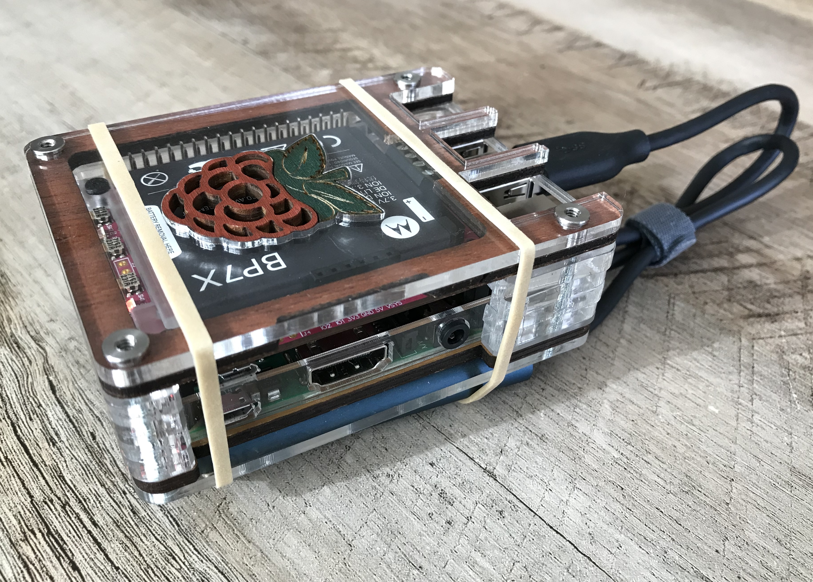
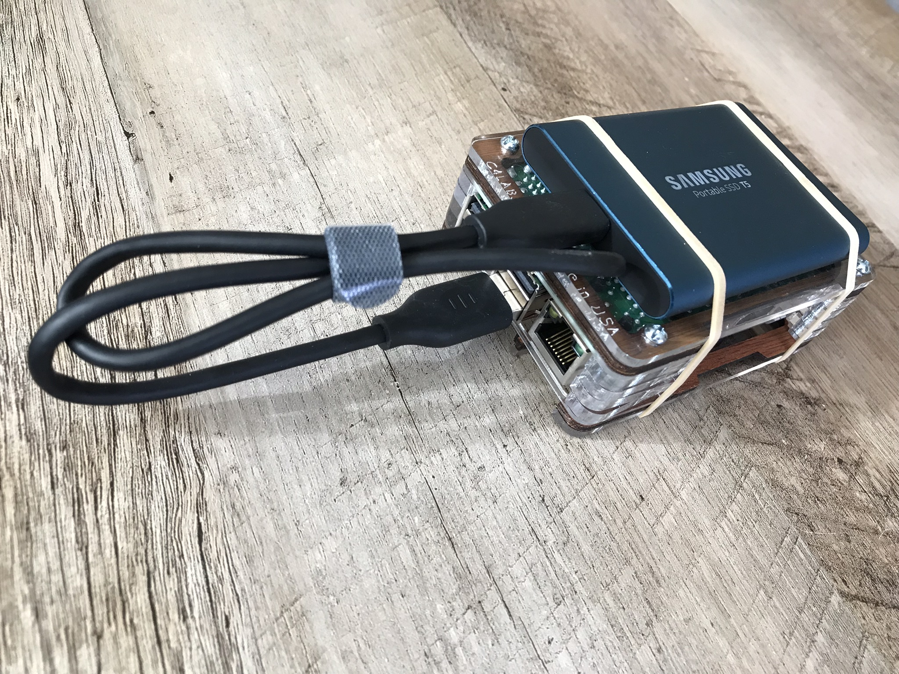

 

Raspberry Pi crypto node

===

[Github repo](https://github.com/thinkmassive/)

# Product Requirements

## Objective

## Core Components

### Software
#### Raspberry Pi
- [RaspiBolt]() guide by Stadicus
#### Bitcoin
- [Bitcoin Core]()
#### Lightning Network
- [LND](https://github.com/lightningnetwork/lnd) - Lightning Network Daemon
- [RTL]() - Ride The Lightning web UI
- [LNDash]() - Lightning Network Dashboard web display
- [Lightning RFC](https://github.com/lightningnetwork/lightning-rfc/blob/master/00-introduction.md)
- [LND Overview and Developer Guide](https://dev.lightning.community/overview/)
- [Macaroons](http://theory.stanford.edu/%7Eataly/Papers/macaroons.pdf) - LND auth cookies (paper)
#### Electrum
- [Electrum Personal Server]()
- https://support.ledger.com/hc/en-us/articles/115005161925-Set-up-and-use-Electrum
#### BTCPay
- [BTCPayServer Documentation](https://github.com/btcpayserver/btcpayserver-doc#documentation) - self-hosted BitPay alternative (.NET)
- [NBXplorer](https://hub.docker.com/r/nicolasdorier/nbxplorer/) - .NET blockchain explorer API
#### GUI:
- [Getting Started with GUIs](https://projects.raspberrypi.org/en/projects/getting-started-with-guis) - very basic tkinter tutorial

### Security Hardening
#### Raspbian
- https://www.debian.org/doc/manuals/securing-debian-howto/
- https://www.raspberrypi.org/documentation/configuration/security.md
- https://opensource.com/article/17/3/iot-security-raspberry-pi
#### USB storage
- https://invisiblethingslab.com/resources/2014/Software_compartmentalization_vs_physical_separation.pdf
- https://security.stackexchange.com/questions/64524/how-to-prevent-badusb-attacks-on-linux-desktop/64552#64552
- https://www.linuxquestions.org/questions/linux-newbie-8/what-is-nosuid-noexec-and-nodevel-301400/
- https://stackoverflow.com/questions/38786343/prevent-usbhid-from-autoloading-when-usb-hid-device-is-plugged-in
#### Random Number Generator
- https://raspberrypi.stackexchange.com/questions/61888/how-to-know-if-dev-hwrng-is-working
- https://www.nico-maas.de/?p=1562

### Hardware
#### Recommended
- Computer: Raspberry Pi 3 B+
- SD card: ATP 4GB CLS10 aMLC
- Storage: Samsung T5 500GB SSD
- Power supply: PiJuice
- Case: 
- Part cost: 40+20+110+70+30=270 (+$8 shipping)
#### Minimum (pruned node)
- Computer: Raspberry Pi 2 B or better
- SD card: 4GB+ class 10
- Storage: 64GB+ USB 
- Power supply: 5V USB
- Case: Geekworm $7 standoff cover
- Part cost: 40+10+20+10+7=77 (+$8 shipping)
#### Airgap (optional)
- Computer: Raspberry Pi Zero (non-W), A+, B, 2B
- SD card: 1GB+ class 10
- Storage: removable
- Power supply: 5V USB
- Case: clear
- Display: PiTFT 2.2" 320x240
- Part cost: 

## User Flow

## Analytics

## Future Features

## Links
