---
taxonomy:
  category: projects
  tag: [projects, hardware, audio, dj]
---

Imported blog post from 2009 Jul 05

===
# Technics 1200 turntable cable replacement

A friend of mine has two Technics 1200 MK2 turntables, and the RCA plugs were damaged when someone removed them by the cables instead of the plugs. One of the ground cables was also cut short, and the other was in rough shape.

Here are the steps I followed to replace the cables on both turntables. Click any of the images to view in full size.

Remove the slipmat to expose the platter. Lift the platter directly up by the two holes to remove it from the spindle (one of the platters came out attached to the spindle... I'm not sure why but it still works fine so I didn't worry about it). Secure the tonearm and place a cover on top of the turntable.
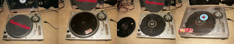

Flip the turntable upside down so it's resting on the top cover. Unscrew each of the four feet to remove them, and then remove the screws that hold rubber bottom cover in place. There are a few different types of screws so I kept them arranged exactly as they are when installed.
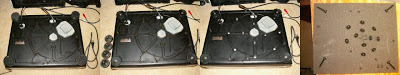

Remove rubber bottom cover by gently prying it off with your fingers.
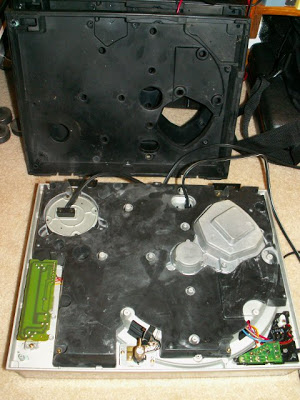

Remove strain-relief from cables by prying side latches with a small flat-head screwdriver. Remember to pay attention to how the cables are routed and how the strain-relief pieces are oriented because you will have to route the new cables through here.
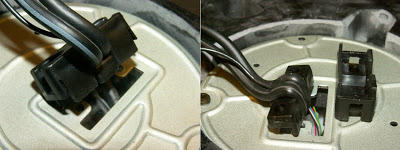

Remove the circular metal plate by unscrewing the two screws, and then carefully slide it off the cables to expose the internal electronics.
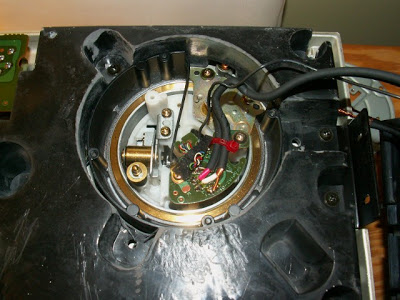

Snip the cable tie to free the cables. Carefully unsolder the cables, and remember to pay close attention to where each is connected on the printed circuit board. Red is the right channel and white is the left channel. The shielding is negative and the center conductor is positive. Clean the pads using a copper wick or a desoldering pump.
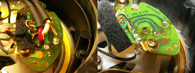

In addition to replacing the RCA cables, I chose to also replace the ground cable. The old one was desoldered from the metal tab and pried off using forceps, using care to leave the ground cable coming from the tonearm intact. In the image you can see the cable from the tonearm still attached, while the external ground cable and the RCA cables are all detached.
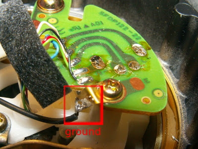

I had some RCA cables available that I chose to cut in half. They have gold plated connectors and I cut them slightly longer than the originals to allow for more options when situating the turntables among other DJ gear. Since these are not brand new I decided to measure the resistance of each conductor.
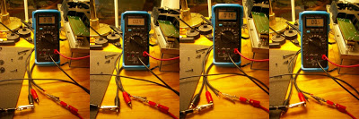

The measurements confirmed the cables were solid. I also opted to check the fit of the plugs on her DJ mixer to make sure they wouldn't be too loose. The ground cable I used was the same length as my replacement RCA cables, and it was slightly larger than the original to minimize breakage, which was a problem with the original ones. I verified that it was still small enough to easily fit two through a typical ground connector on a DJ mixer.
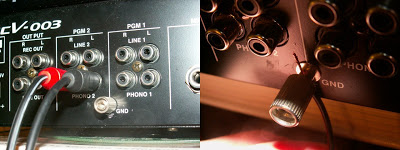

The ground wire was pulled through the hole in the metal tab and soldered to the tab. The audio cable and ground wire were then secured to the PCB with a zip-tie. This holds them in place for easy soldering. All 5 wires are re-soldered in the right-hand image below.
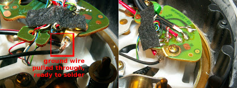

After all wires are re-soldered, the cables are fed back through the metal plate, which is re-attached with two screws. Now the strain-relief needs to be re-attached, leaving just enough slack in the cables such that they aren't pulling on the zip-tie. The strain-relief is screwed to the metal plate with two screws. It is important to insert the bottom of the strain-relief with the correct side facing up. At first I couldn't get it to lay flat against the plate, then I finally realized I had the bottom piece upside down.
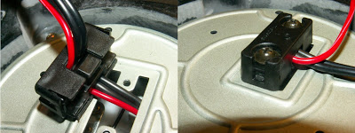

Finally I could replace the bottom cover and secure it with all of the screws. The feet were also screwed back in place. Put the platter and slipmat back on, and connect the new cables to a mixer for testing. There was no hum (ground works) and I had a clear signal of equal volume in both left and right channels--SUCCESS!
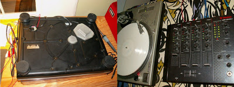
